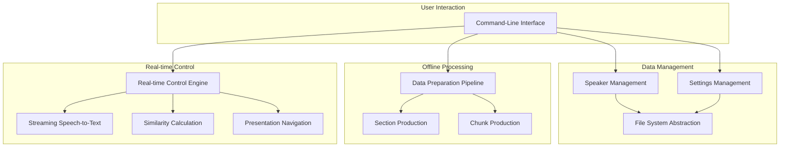

# Architecture

The `moves` system is designed with a clear separation of concerns, dividing its operation into two main phases: an **offline data preparation pipeline** and a **real-time presentation control engine**. This dual-phase architecture maximizes performance during a live presentation by pre-processing all computationally intensive tasks. The system is layered, comprising a Command-Line Interface (CLI), a Data Management Layer, a Data Preparation Pipeline, and a Real-time Control Engine.

## High-Level Overview

The following diagram illustrates the high-level architecture of the `moves` system, showing how the different components interact with each other.

## System Components

### 1. Command-Line Interface (CLI)

The CLI is the primary user-facing component, built with the **Typer** library. It serves as the entry point for all user interactions, translating commands, arguments, and options into calls to the underlying system components. The CLI is responsible for:

- **Validating user input**, such as file paths and command arguments.
- **Orchestrating the application's workflow**, including data preparation and presentation control.
- **Providing structured and informative feedback** to the user.

### 2. Data Management Layer

This layer is responsible for all file system interactions, ensuring data integrity and consistency within the `~/.moves` directory. It consists of three main components:

- **Settings Management (`SettingsEditor`):** Manages global configurations, such as the AI model and API key, stored in `~/.moves/settings.toml`. It uses the `tomlkit` library to preserve the structure and comments of the configuration file.
- **Speaker Management (`SpeakerManager`):** Manages the lifecycle of speaker profiles. Each speaker is assigned a unique directory containing their metadata, source files, and processed data. The manager can resolve speaker profiles from either a unique ID or a name.
- **File System Abstraction (`data_handler`):** A utility that centralizes all file system operations, ensuring that all interactions are sandboxed within the `~/.moves` directory.

### 3. Data Preparation Pipeline

This offline pipeline is triggered by the `moves speaker process` command. It transforms the raw presentation and transcript PDFs into a structured format optimized for real-time analysis. The pipeline consists of two main stages:

- **Section Production (`section_producer`):** This stage uses `PyMuPDF` to extract text from the presentation and transcript. It then interacts with a Large Language Model (LLM) through `litellm` and `instructor` to segment the transcript into "Sections," each corresponding to a single slide.
- **Chunk Production (`chunk_producer`):** This stage takes the `sections.json` file produced by the previous stage and creates "Chunks." A sliding window algorithm moves across the text of each section, creating overlapping text segments of a fixed length. This creates a granular and redundant dataset that is resilient to variations in spoken delivery.

### 4. Real-time Control Engine

Activated by the `moves presentation control` command, this engine manages the live, voice-controlled session. It uses a multi-threaded architecture to ensure non-blocking performance and consists of three main components:

- **Streaming Speech-to-Text (STT):** An `OnlineRecognizer` from the `sherpa-onnx` library performs continuous, low-latency transcription of the speaker's voice.
- **Similarity Calculation (`SimilarityCalculator`):** This component compares the transcribed text with a set of "candidate chunks" to find the best match. It uses a hybrid model that combines **semantic similarity** (using `fastembed`) and **phonetic similarity** (using `jellyfish` and `rapidfuzz`) to achieve a high degree of accuracy.
- **Presentation Navigation:** The engine identifies the chunk with the highest similarity score and determines the target slide. It then uses the `pynput` library to simulate keyboard events (e.g., Right Arrow key presses) to navigate the presentation. A parallel listener thread monitors for manual keyboard input, allowing the user to override the automatic navigation at any time.