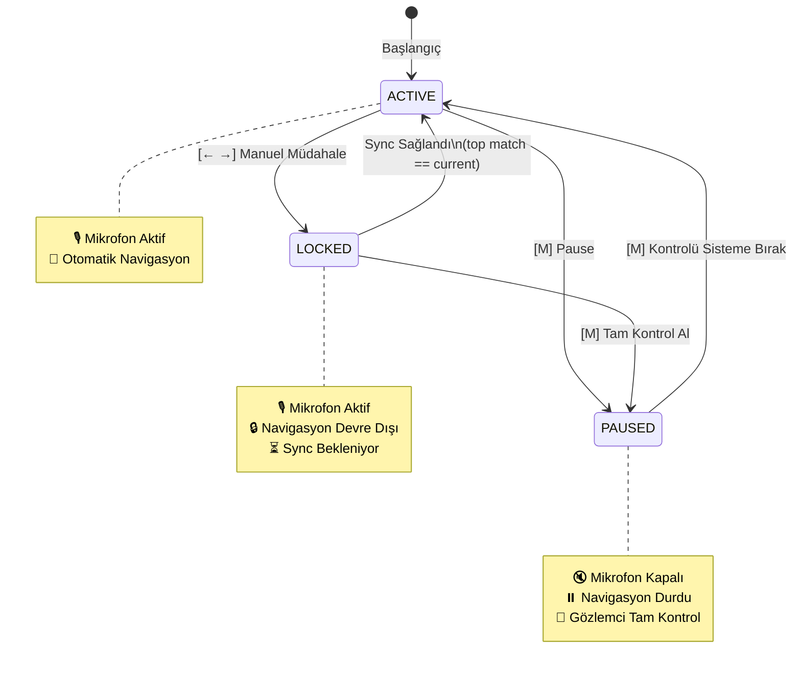

# Manual Controls Design Document

> **Feature**: Mic-Stop & Manual Navigation Controls  
> **Status**: ✅ Implemented  
> **Created**: 2026-01-14  
> **Implemented**: 2026-01-14

## Overview

Bu doküman, sunum kontrol sistemine eklenen manuel kontrol özelliklerinin tasarımını açıklar. Amaç, supervisor deneyimini iyileştirmek ve sunum güvenilirliğini artırmaktır.

> [!IMPORTANT] > **Pencere Odağı**: İşletim sistemindeki odak her zaman sunum yapılan pencerede (PowerPoint, Google Slides, vb.) olacaktır, terminalde değil. Bu nedenle ok tuşlarına basıldığında işletim sistemi zaten sunum penceresine müdahale eder. moves-cli sadece bu tuşları "gözlemler" ve state yönetir.

## Konsensüs Prensibi

moves ve gözlemci (supervisor), hangi slaytın gözükmesi gerektiği konusunda **mutabık** olmalıdır. `LOCKED` state bu konsensüs sağlanana kadar sistemin otomatik müdahalesini engeller.

## State Machine

Sistem üç durumda çalışır:

| State    | Açıklama                                                           |
| -------- | ------------------------------------------------------------------ |
| `ACTIVE` | Normal çalışma - ses dinleniyor, otomatik navigasyon aktif         |
| `PAUSED` | Mikrofon duraklatılmış - ses işlenmiyor ama klavye dinleniyor      |
| `LOCKED` | Manuel müdahale sonrası - ses dinleniyor ama navigasyon devre dışı |

```python
class ControllerState(StrEnum):
    ACTIVE = "ACTIVE"
    PAUSED = "PAUSED"
    LOCKED = "LOCKED"
```

## Keyboard Controls

Global keyboard listener ile tuş dinleme:

| Tuş   | Açıklama                    |
| ----- | --------------------------- |
| **M** | State toggle (pause/resume) |
| **←** | Sol ok - slide geri         |
| **→** | Sağ ok - slide ileri        |

## State Davranışları (Detaylı)

### ACTIVE State

Normal çalışma modu. Sistem ses dinliyor ve otomatik navigasyon aktif.

| Input              | Davranış     | Açıklama                                                                                 |
| ------------------ | ------------ | ---------------------------------------------------------------------------------------- |
| **→**              | `LOCKED` yap | Sistem LOCKED'a geçer. Tuş basımı yapmaz çünkü OS zaten sunum penceresine müdahale eder. |
| **←**              | `LOCKED` yap | Sistem LOCKED'a geçer. Tuş basımı yapmaz çünkü OS zaten sunum penceresine müdahale eder. |
| **M**              | `PAUSED` yap | Sistem PAUSED'a geçer. Mikrofon ve işleme durur.                                         |
| **Otomatik Karar** | Navigasyon   | Eşleşme bulunursa sistem tuş basımı yaparak slide değiştirir.                            |

### LOCKED State

Manuel müdahale sonrası. Sistem ses dinliyor ama otomatik navigasyon devre dışı.

| Input              | Davranış     | Açıklama                                                                                                        |
| ------------------ | ------------ | --------------------------------------------------------------------------------------------------------------- |
| **→**              | `LOCKED` kal | Tuş basımı yapmaz, OS zaten yapıyor. Supervisor birden fazla slide atlayabilir.                                 |
| **←**              | `LOCKED` kal | Tuş basımı yapmaz, OS zaten yapıyor. Supervisor birden fazla slide atlayabilir.                                 |
| **M**              | `PAUSED` yap | **ÖNEMLİ**: ACTIVE değil PAUSED! Gözlemci muhtemelen kontrolü tamamen ele almak istiyor (1000 kişi karşısında). |
| **Otomatik Karar** | Sync kontrol | Top match == current section ise kilit açılır → `ACTIVE`. Aksi halde bekler.                                    |

### PAUSED State

Sistem tamamen susturulmuş. Gözlemci tam kontrol sahibi.

| Input              | Davranış     | Açıklama                                                                                                                  |
| ------------------ | ------------ | ------------------------------------------------------------------------------------------------------------------------- |
| **→**              | `PAUSED` kal | Tuş basımı yapmaz, OS zaten yapıyor. Sistem susturulmuş.                                                                  |
| **←**              | `PAUSED` kal | Tuş basımı yapmaz, OS zaten yapıyor. Sistem susturulmuş.                                                                  |
| **M**              | → `ACTIVE`   | **ÖNEMLİ**: Önceki state (LOCKED veya ACTIVE) ne olursa olsun ACTIVE'e döner. Gözlemci kontrolü sisteme bırakmak istiyor. |
| **Otomatik Karar** | Yok          | Sistem herhangi bir aksiyon almaz veya yapmaz.                                                                            |

## State Özet Tablosu

| State    | Mikrofon      | STT Processing | Navigasyon    |
| -------- | ------------- | -------------- | ------------- |
| `ACTIVE` | ✅ Aktif      | ✅ Çalışıyor   | ✅ Otomatik   |
| `PAUSED` | ❌ Devre dışı | ❌ Durmuş      | ❌ Yok        |
| `LOCKED` | ✅ Aktif      | ✅ Çalışıyor   | ❌ Devre dışı |

## State Flow Diagram



## Implementation Details

### Kod Değişiklikleri

```
presentation_controller.py
├── + ControllerState enum
├── + self._state (thread-safe Event/Lock ile)
├── + self._keyboard_listener_thread
├── + _on_key_press() callback
├── ~ _audio_sampler_callback() → PAUSED ise ses işleme
├── ~ _navigator_task() → LOCKED ise navigasyon yapma, sync kontrolü
└── ~ control() → listener başlat/durdur
```

### Echo Prevention

Otomatik navigasyon sırasında `pynput.Controller` ile basılan tuşlar, kendi `Listener`'ımız tarafından yakalanmamalı. Bunun için bir flag kullanacağız:

```python
self._echo_suppression = threading.Event()

def _perform_navigation(self, target_section: Section) -> None:
    self._echo_suppression.set()  # Suppress listener
    try:
        # ... press keys ...
    finally:
        self._echo_suppression.clear()

def _on_key_press(self, key) -> None:
    if self._echo_suppression.is_set():
        return  # Ignore echoed keys
    # ... handle key ...
```

### Thread Safety

State değişiklikleri thread-safe olmalı çünkü birden fazla thread aynı anda erişebilir:

- Audio callback → ana thread
- STT processor → thread 1
- Navigator → thread 2
- Keyboard listener → thread 3

```python
self._state = ControllerState.ACTIVE
self._state_lock = threading.Lock()

def _set_state(self, new_state: ControllerState) -> None:
    with self._state_lock:
        self._state = new_state

def _get_state(self) -> ControllerState:
    with self._state_lock:
        return self._state
```

## Display Updates

Mevcut terminal çıktısına state bilgisi eklenecek:

```
1/30 | %85 | ■ | 🎙️ | [15w] | ACTIVE
    Speech → ...bu sunum hakkında
    Match  → ...bu sunum hakkında
```

## Future: Rich UI Integration

`experiments/rich_ui_demo.py` dosyasındaki Rich UI tasarımı, bu state machine ile entegre edilecek. UI zaten footer'da keyboard shortcuts gösteriyor:

```
[M] Pause  [← →] Nav  [Q] Quit
```

Rich UI entegrasyonu ayrı bir issue olarak ele alınacak.

## Test Scenarios

### Normal Cases

1. **Normal Flow**: Konuşma ile otomatik slide geçişi (`ACTIVE` state)
2. **Pause/Resume**: `ACTIVE` → [M] → `PAUSED` → [M] → `ACTIVE`
3. **Manual Override**: `ACTIVE` → [→] → `LOCKED` → (konuşma devam, sync) → `ACTIVE`
4. **Multi-step Manual**: `ACTIVE` → [→→→] → `LOCKED` (3 slide ileri) → (sync) → `ACTIVE`

### Edge Cases

5. **LOCKED'dan Tam Kontrol**: `ACTIVE` → [→] → `LOCKED` → [M] → `PAUSED` (ACTIVE değil!)
6. **PAUSED'da Ok Tuşları**: `PAUSED` + [→] → `PAUSED` kalır (state değişmez)
7. **LOCKED'da Ok Tuşları**: `LOCKED` + [→] → `LOCKED` kalır (sadece current section güncellenir)
8. **Echo Prevention**: Otomatik navigasyon sırasında basılan tuşlar listener'ı tetiklememeli
9. **Thread Safety**: Birden fazla thread aynı anda state değiştirmeye çalışırsa race condition olmamalı
